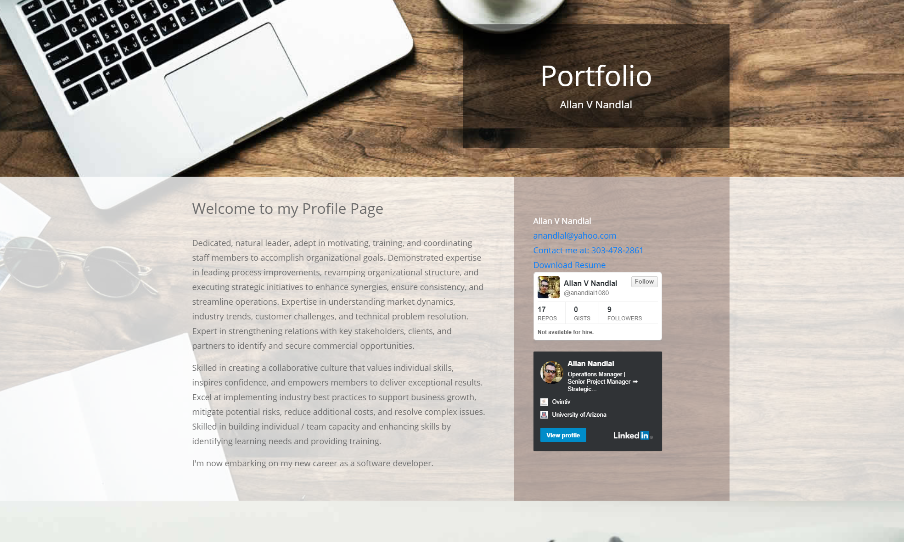

# Allan V Nandlal Portfolio

This project has been deployed to: https://anandlal1080.github.io/portfolio/

Welcome to my portfoilio page!

Here you can get a brief introduction about me..

You can also get my contact info which includes my email and phone number.

There is also a copy of my resume available for download, a link to ny Github profile and my LinkedIn profile.

Here are 3 projects that I've recently completed.

The first project is a covid-19 dashboard for all the US States and Countries around the world.

The second is a daily planner application.

The third is a weather app that allows you to get weather for a specific City or Country.

Links are provided to teh deployed apps as well as the Github repos.

Here is a form that can be used to contact me is needed.
